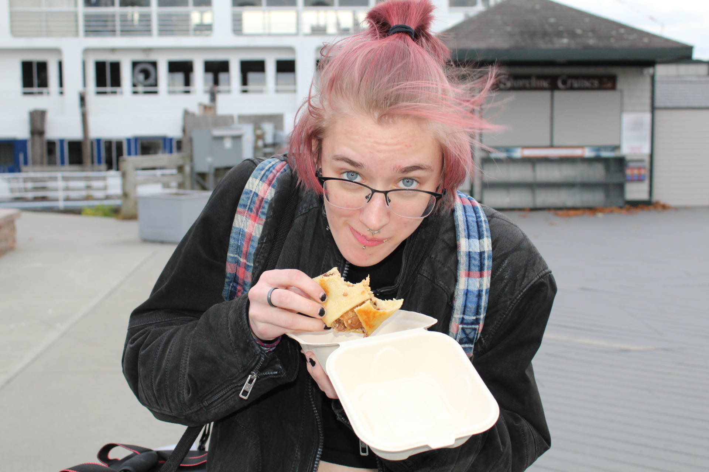

# ME!  
I'm Steil (they/them). A junior conservation biology major at Middlebury College.  

image: 

As seen in the photo, I enjoy a good snack or two.  
My other hobbies:  

* Video games  
* Reading  
* Making bracelets  
* Listening to music  

[My current playlist:](https://open.spotify.com/playlist/4W5QUjnXlFIpto1vmHN9VT?si=d735a5747e8844e0)  

Watching movies and TV shows didn't *quite* make the list, but I do have a few favorites.  

1. Scott Pilgrim vs. the World
2. Adventure Time
3. Bojack Horseman


## My Cat!  
I live with my cat, Diamond, on campus at the Mill. In true mill fashion, **FUCK**
 the Mill. 
 
 Pros | Cons | Mill
------------- | ------------- | ------------
Wakes me up at a reasonable hour | wakes me up | The Mill is weirdly quite in the mornings
Develops Routine | I can't always be home | The Mill isn't a good place for routines
Companion! | It can be costly to own a cat | Many Mill goers are allergic
A calming energy | Only Sometimes | Not a calming environment
A friend | She wishes to escape | Not a place for cats  


### The Other things
My favorite equation, you may ask?  
$a^{2} + b^{2} = c^{2}$

Occasionally, I incorporate a trademark into my speech, saying something like 'I love proc food^tm^.' Rarely would I announce my use of a subscript ~but~ I do find them useful.  

```Cat!``` 
Plain text within fencing