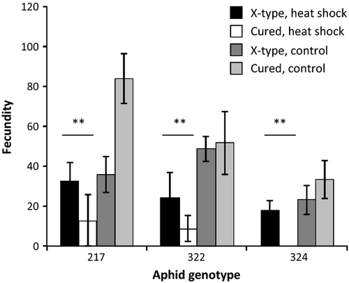

1. Go to Dryad to choose a published paper and data set and reconstruct your own figure. Code a ggplot graph that looks as close to the published figure as you can.




```{r setup, message=FALSE, error=FALSE}

## Set up libraries
library(tidyverse)
library(ggthemes)

dryadData <- read.table("data/HeatShock.csv", header=TRUE, sep=",", stringsAsFactors = TRUE)
#view(dryadData)

dryadData$Aphid.Genotype <- factor(dryadData$Aphid.Genotype, 
                              levels=c("217",
                                       "322", "324"))

dryadData <- unite(dryadData, "groups", c(X.type.presence, Treatment), remove = FALSE)


pp<- ggplot(data=dryadData, 
           aes(x=Aphid.Genotype,
               y=Offspring, fill=groups)) + 
        geom_bar(position="dodge", stat="identity", color="black") + 
    ylab("Fecundity") +  xlab("Aphid genotype") + 
  scale_y_continuous(breaks = c(0,20,40,60,80,100,120)) +
  scale_fill_grey()
#,c("Cured, control", "Cured, heat shock", "X-type, control", "X-type, heat shock")) 

#fills in boxes with grey scale
  #theme(panel.background = element_rect(fill = 'gray94', color = 'black'), legend.position="top",  legend.title= element_blank(), axis.title.y = element_text(size=12, face="bold", colour = "black"), strip.text.y = element_text(size = 10, face="bold", colour = "black")) + #edits the text within the labels, and adds a legend to the top of the graph

pp

```