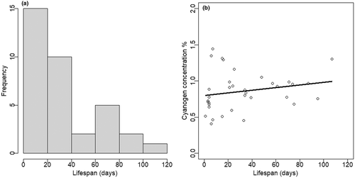

1. Go to Dryad to choose a published paper and data set and reconstruct your own figure. Code a ggplot graph that looks as close to the published figure as you can.




```{r setup, message=FALSE, error=FALSE}

## Set up libraries
library(tidyverse)
library(ggthemes)


dryadData <- read.table("data/Keller_etal_2017_JoH_SNPdata_DRYAD.csv", header=TRUE, sep=",", stringsAsFactors = TRUE)


print(dryadData)


```