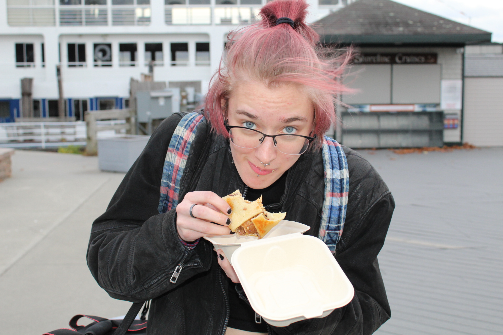

# Reproducible Biology in R  

   

Steil ('24) is an undergraduate at Middlebury College, majoring in conservation biology. They compete on the college equestrian team, and enjoys podcasts and video games when they have time. This page is designed for their J-Term class, Reproducible Biology in R.

## Assignments

[Assignment 1](Assignment_1.html)   
[Assignment 2](Assignment_2.html)   
[Assignment 3](Assignment_3.html)   
[Assignment 4 & 5](Assignment_4_and_5.html)

## Weekly Assignments
[Week 2](WeeklyAssignment_1.html)   
[Week 3](WeeklyAssignment_2.html)

